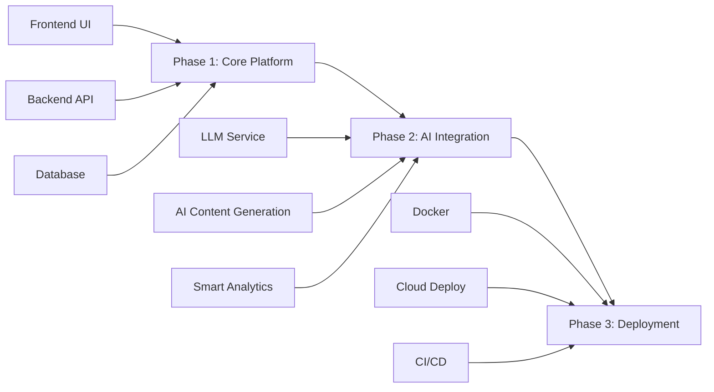

# 📧 MailFlow - GenAI Mailer System Interview Project

<div align="center">

<div align="center">

```
    ███╗   ███╗ █████╗ ██╗██╗     ███████╗██╗      ██████╗ ██╗    ██╗
    ████╗ ████║██╔══██╗██║██║     ██╔════╝██║     ██╔═══██╗██║    ██║
    ██╔████╔██║███████║██║██║     █████╗  ██║     ██║   ██║██║ █╗ ██║
    ██║╚██╔╝██║██╔══██║██║██║     ██╔══╝  ██║     ██║   ██║██║███╗██║
    ██║ ╚═╝ ██║██║  ██║██║███████╗██║     ███████╗╚██████╔╝╚███╔███╔╝
    ╚═╝     ╚═╝╚═╝  ╚═╝╚═╝╚══════╝╚═╝     ╚══════╝ ╚═════╝  ╚══╝╚══╝
```

<h3>🚀 AI-Powered Email Marketing Platform</h3>
<p><em>Build the future of email marketing with GenAI</em></p>

[](https://github.com/Juni-crypto/MailFlow-Interview-Sys)
[](https://github.com/Juni-crypto/MailFlow-Interview-Sys)
[](https://github.com/Juni-crypto/MailFlow-Interview-Sys)

</div>

*A modern, AI-powered email marketing platform built for the GenAI era*

[](https://github.com/Juni-crypto/MailFlow-Interview-Sys/stargazers)
[](https://github.com/Juni-crypto/MailFlow-Interview-Sys/network/members)
[](https://github.com/Juni-crypto/MailFlow-Interview-Sys/issues)
[](LICENSE)

</div>

## 🎯 Welcome to Your Full-Stack GenAI Engineer Interview!

Congratulations on making it to the technical interview stage! Instead of traditional whiteboard coding, we believe in evaluating your skills through real-world project development. You'll be building **MailFlow** - a modern email marketing platform with AI capabilities.


## 🚀 Getting Started

### Prerequisites
Before you begin, ensure you have:
- Node.js (v18 or higher)
- Python (v3.9 or higher)
- Git
- Your favorite code editor
- A cup of coffee ☕

### 📋 How to Participate

1. **⭐ Star this repository** (This helps us track participants)
2. **🍴 Fork this repository** to your GitHub account
3. **📥 Clone your fork** locally:
   ```bash
   git clone https://github.com/YOUR_USERNAME/MailFlow-Interview-Sys.git
   cd MailFlow-Interview-Sys
   ```
4. **🚀 Quick Setup**:
   ```bash
   # Run the setup script
   chmod +x setup.sh
   ./setup.sh
   
   # Or manual setup
   npm run install:all
   ```
5. **🌿 Create Phase 1 branch**:
   ```bash
   git checkout -b phase-1/your-name-core-platform
   ```

## 📊 Project Overview

MailFlow is a comprehensive email marketing platform similar to Mailchimp, but enhanced with modern GenAI capabilities. You'll build this in three progressive phases:

<div align="center">



</div>

## 🎯 Phase 1: Core Platform (Days 1-3)


### 🎨 Essential Frontend Features
- [ ] User authentication (login/register)
- [ ] Dashboard with campaign overview
- [ ] Simple email editor
- [ ] Contact list management
- [ ] Campaign creation and sending
- [ ] Basic analytics

### 🔧 Essential Backend Features
- [ ] JWT authentication API
- [ ] Campaign CRUD operations
- [ ] Contact management API
- [ ] Email sending service
- [ ] Basic analytics tracking

**Timeline: 3 days**

## 🤖 Phase 2: AI Integration (Days 4-5)


### 🧠 AI Features
- [ ] AI email content generation
- [ ] Smart subject line suggestions
- [ ] Email personalization
- [ ] Send time optimization
- [ ] A/B testing with AI

**Timeline: 2 days**

## 🚀 Phase 3: Deployment (Days 6-7)


### ☁️ Deployment Goals
- [ ] Docker containerization
- [ ] Cloud deployment (Vercel/Railway)
- [ ] Database hosting
- [ ] Environment configuration
- [ ] Live application

**Timeline: 2 days**

## 📝 Submission Guidelines

### 🔄 Pull Request Process

1. **Create feature branches** for each phase:
   ```bash
   git checkout -b phase-1/core-platform
   git checkout -b phase-2/ai-integration
   git checkout -b phase-3/deployment
   ```

2. **Commit frequently** with descriptive messages:
   ```bash
   git commit -m "feat: implement email template editor with drag-and-drop"
   git commit -m "fix: resolve authentication token expiry issue"
   ```

3. **Create Pull Requests** for each phase:
   - Use the provided PR templates
   - Include screenshots/GIFs of functionality
   - Document any challenges faced
   - Explain your technical decisions

### 📊 Evaluation Criteria

| Category | Weight | Description |
|----------|--------|-------------|
| **Code Quality** | 25% | Clean, readable, maintainable code |
| **Functionality** | 25% | Features work as expected |
| **AI Integration** | 20% | Creative and effective use of GenAI |
| **Architecture** | 15% | System design and scalability |
| **Documentation** | 10% | Clear setup and usage instructions |
| **Innovation** | 5% | Creative solutions and extra features |

## 🎨 Design Resources

### 🎯 UI/UX Inspiration
- [Mailchimp](https://mailchimp.com) - Reference for core functionality
- [ConvertKit](https://convertkit.com) - Modern email marketing UI
- [Beehiiv](https://beehiiv.com) - Clean, modern design

### 🎨 Design Assets
- **Color Palette**: 
  - Primary: `#4F46E5` (Indigo)
  - Secondary: `#06B6D4` (Cyan)
  - Accent: `#F59E0B` (Amber)
- **Typography**: Inter, Roboto, or system fonts
- **Icons**: Heroicons, Lucide, or Feather icons

## 🆘 Need Help?


### 📞 Getting Support
- **Slack Channel**: #mailflow-interview
- **Email**: interview-support@company.com
- **Office Hours**: Mon-Fri, 2-4 PM IST
- **Response Time**: Within 4 hours during business days

### 🤝 Collaboration Guidelines
- Feel free to ask questions about requirements
- Discuss technical approaches before major decisions
- Share progress updates in your PRs
- Don't hesitate to reach out if you're stuck!

## 📚 Resources & References

### 🔧 Technical Documentation
- [Email API Best Practices](https://sendgrid.com/docs/api-reference/)
- [React Email Templates](https://react.email/)
- [OpenAI API Documentation](https://platform.openai.com/docs)
- [Docker Best Practices](https://docs.docker.com/develop/dev-best-practices/)

### 📖 Learning Materials
- [Email Marketing Fundamentals](https://blog.mailchimp.com/email-marketing-guide/)
- [GenAI in Marketing](https://www.mckinsey.com/capabilities/growth-marketing-and-sales/our-insights/the-age-of-ai-powered-marketing)

## 🏆 Bonus Points

Impress us with these additional features:
- [ ] Real-time collaboration on email templates
- [ ] Advanced email automation workflows
- [ ] Integration with popular CRM systems
- [ ] Mobile app (React Native/Flutter)
- [ ] Advanced AI features (image generation, voice synthesis)
- [ ] Comprehensive test coverage (>80%)

## 📄 License

This project is licensed under the MIT License - see the [LICENSE](LICENSE) file for details.

---

<div align="center">

**Ready to build the future of email marketing?** 🚀


*Good luck, and we can't wait to see what you create!*

**Questions? Reach out anytime!** 💬

</div>